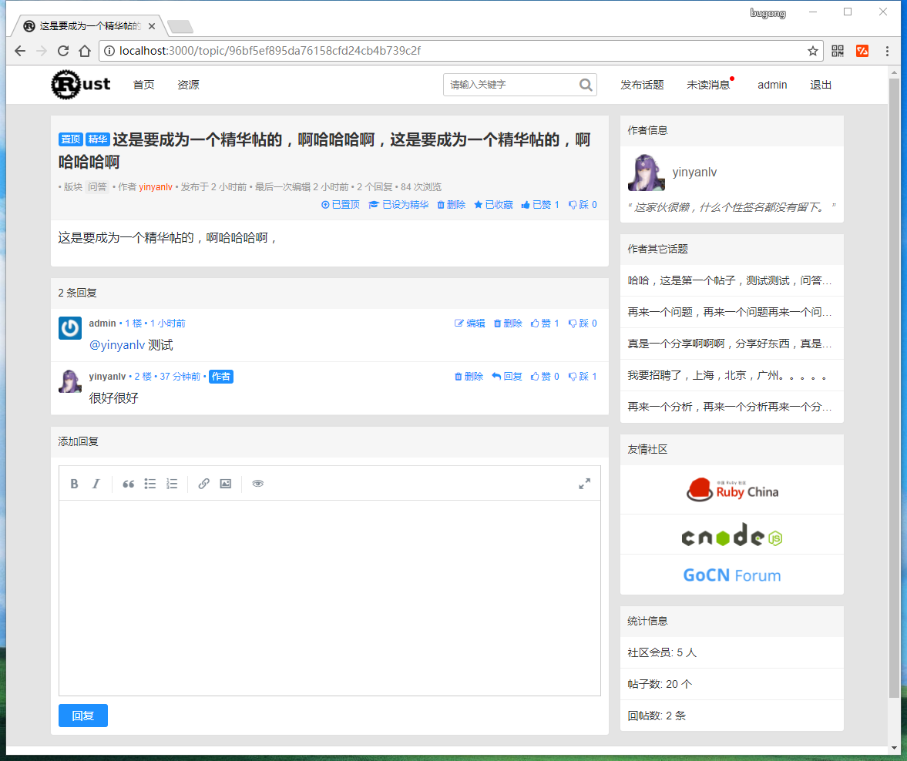

# runner
[](https://www.travis-ci.org/yinyanlv/runner)
[](./LICENSE)

## 介绍
runner 是一个使用 **Rust** 语言开发的社区论坛系统，界面优雅，功能完整，响应式布局，完全兼容PC（IE9+）和手机端。该项目完全开源，且将持续优化和完善，欢迎提issue, star, fork等

## 主要功能
* 登录（支持github oauth登录）
* 注册
* 发送邮件（通过邮箱重置密码）
* 图片上传
* 创建、编辑、删除话题
* 创建、编辑、删除评论（支持@某用户）
* 收藏话题
* 点赞、点踩话题及评论
* 置顶、加精
* 消息提醒
* 用户中心
* 全站话题搜索
* RSS

## 依赖
* mysql
* redis
* open-ssl  [[教程]](https://github.com/sfackler/rust-openssl)  [[windows open-ssl下载地址]](http://slproweb.com/products/Win32OpenSSL.html)
* sass  **该项不是必须的**，目前网站样式表源码采用scss编写，如果你不打算使用scss编写样式表源码，可忽略该项

## 启动
```
1. clone项目到本地
2. 启动mysql和redis
3. 将项目根目录下的tables.sql导入到mysql对应的数据库中（默认runner）
4. 配置项目根目录下的config.toml，主要是更改mysql节点下的用户名、密码、数据库名（默认runner），其他项可暂时不改，不影响启动
5. cargo run
6. 访问http://localhost:3000
```

## 截图

**PC**




**mobile**


## License
MIT